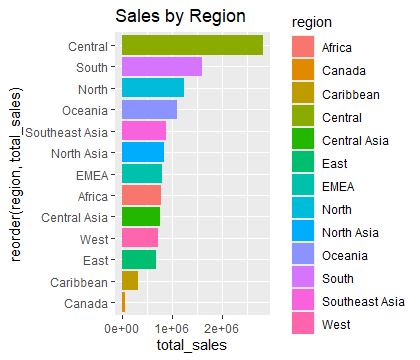
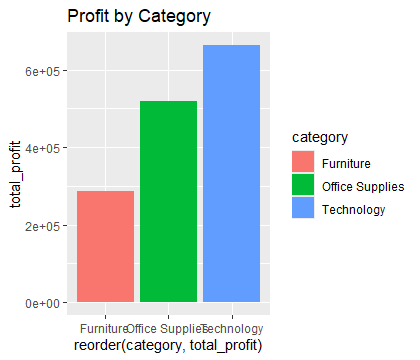
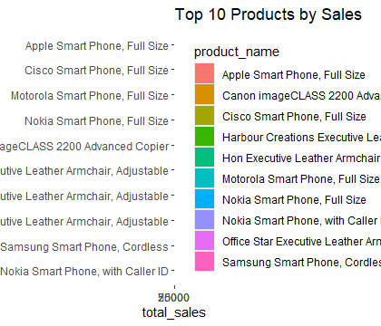

# Superstore Sales Analysis

## Project Overview
This project analyzes retail sales data from the Sample Superstore dataset to understand sales performance, profitability, and regional trends.

## Dataset
Dataset: Sample Superstore Dataset  
Source: Kaggle  

The dataset contains information about orders, customers, regions, product categories, sales, and profit.

## Tools Used
- R
- tidyverse
- dplyr
- ggplot2

## Data Cleaning
The dataset was checked for missing values, duplicates, and incorrect data types. Basic transformations were applied before analysis.

## Key Questions
1. Which region generates the highest sales?
2. Which category produces the most profit?
3. Which products generate the highest revenue?

## Key Insights
- Some regions generate significantly higher sales than others.
- Technology products tend to generate higher profit.
- A small group of products contribute heavily to total revenue.

## Visualizations
Charts were created using ggplot2 to show sales distribution and profitability across categories and regions.

## Conclusion
The analysis highlights important sales patterns and profitable product categories, which can help businesses make better strategic decisions.

## Visualizations

### Sales by Region

### Profit by Category

### Top 10 Products by Sales

